# Junior Legal Research Platform - Architecture & Diagrams

## 🏗️ System Architecture

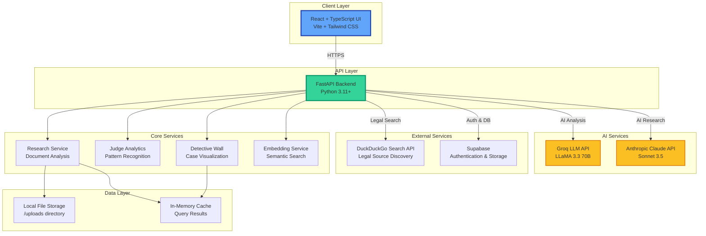

---

## 🔄 Data Flow Diagram

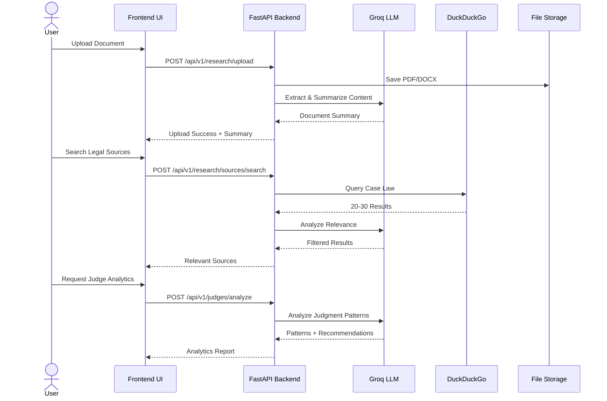

---

## 🎯 Feature Flow: Detective Wall

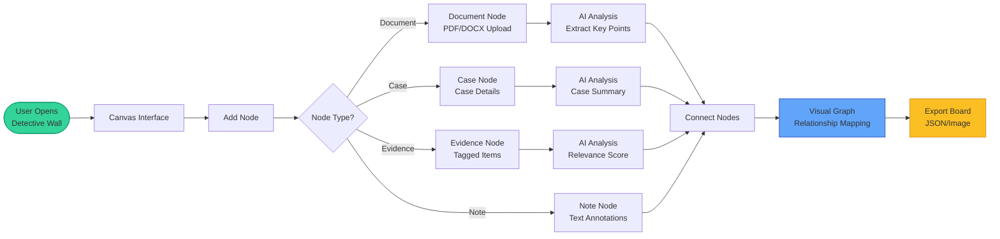

---

## 🔍 Judge Analytics Workflow

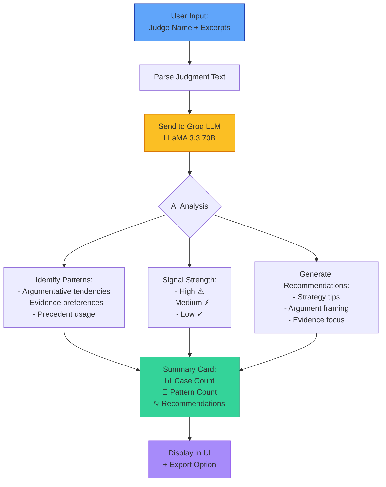

---

## 🎭 Devil's Advocate Simulation Flow

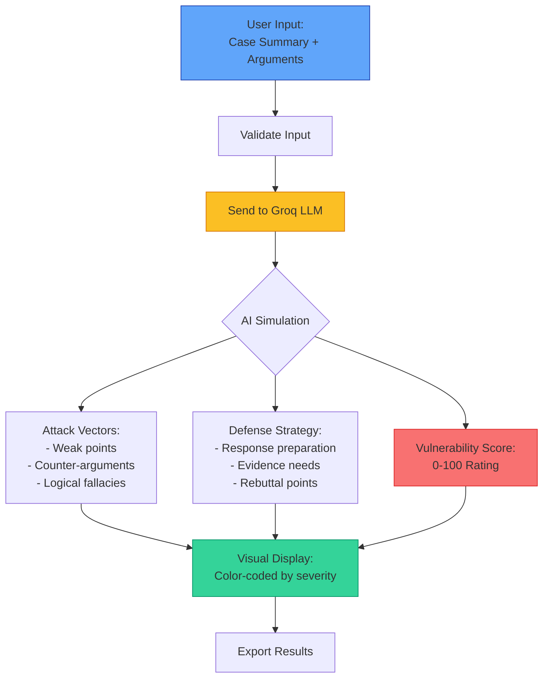

---

## 🔐 Authentication & Security Flow

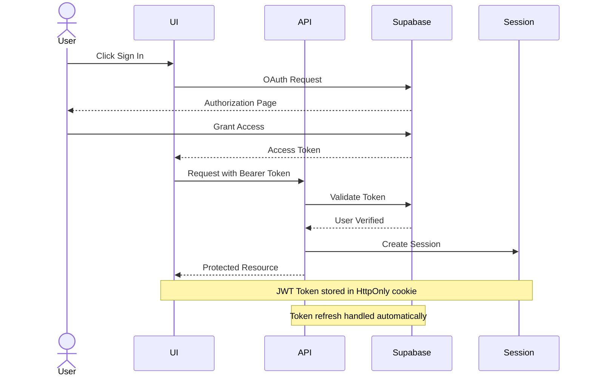

---

## 📊 Search Service Architecture

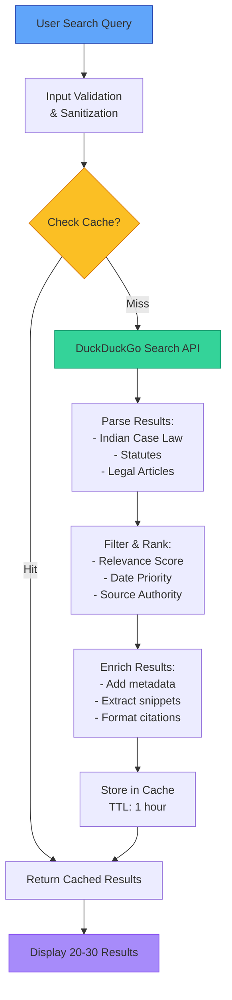

---

## 🧠 AI Service Integration

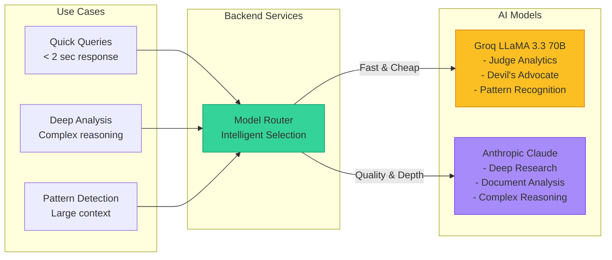

---

## 🗄️ Data Model Relationships

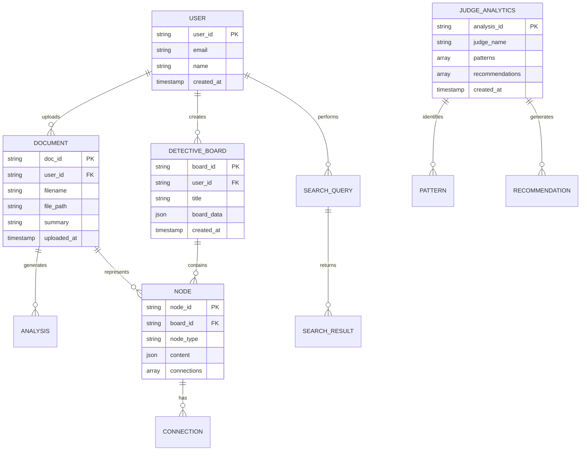

---

## 🚀 Deployment Architecture (Current)

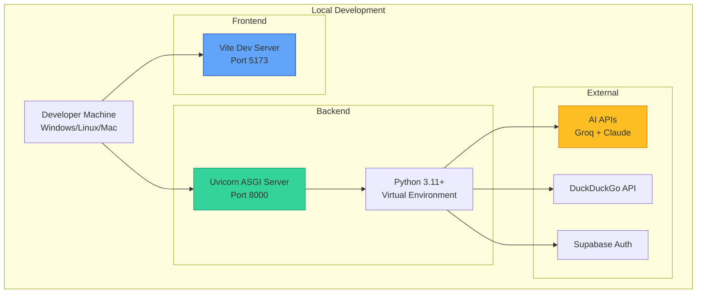

---

## 🔮 Proposed Production Architecture

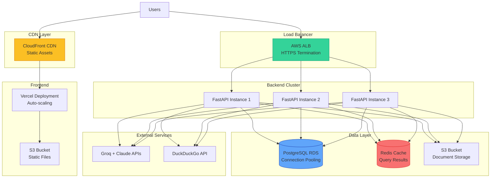

---

## 📈 Performance Optimization Strategy

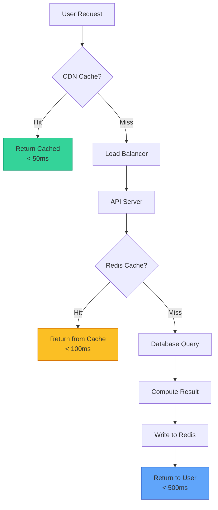

---

## 🎨 Component Architecture (Frontend)

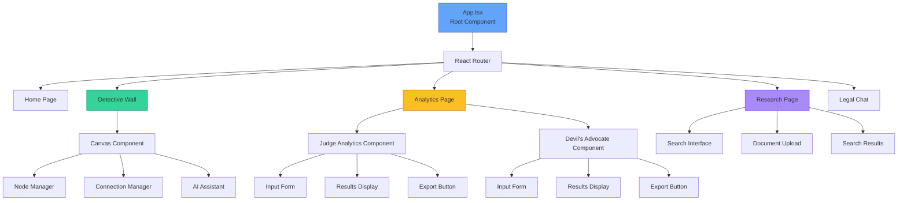

---

## 🔄 State Management Flow

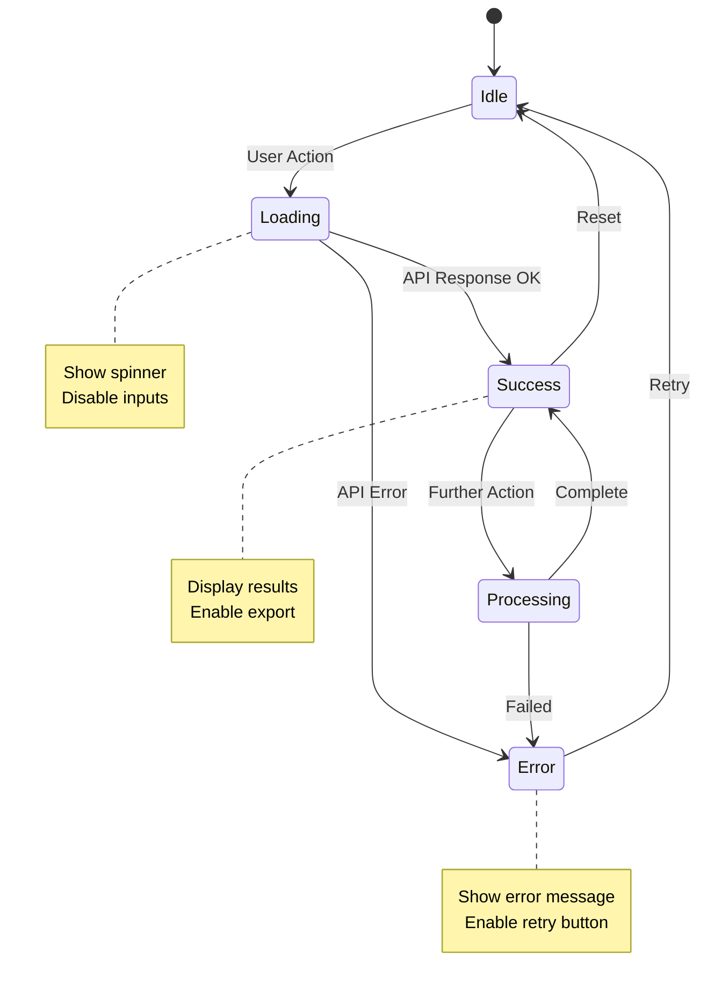

---

*All diagrams are rendered automatically in GitHub, GitLab, and modern markdown viewers.*
